# TimeInData
[English version](README_EN.md)<br/>
Сервис для тайм-менеджмента

[](https://www.docker.com)
[](https://docs.pytest.org/en/)
[](https://fastapi.tiangolo.com)
[](https://github.com/aiogram/aiogram)
[](https://reactjs.org)
[](https://www.postgresql.org)
[](https://redis.io)
[](https://www.rabbitmq.com)

---
## Суть сервиса

Отслеживание активностей (работа/учеба/отдых и т.д.) каждый час для наглядного просмотра того, на что 
уходит больше всего времени.

---
## Установка

1. Склонировать данный репозиторий с помощью
    ```bash
    git clone https://github.com/Kemuni/TimeInData.git
    ```
2. Скопировать `example.env` в файл `.env` и заполнить его своими данными.
3. Запустить следующую команду, чтобы запустить сервисы:
   ```bash
   docker compose up -d --build
   ```
   или `docker compose watch` для запуска в режиме разработки.

Теперь мы можем использовать следующие сервисы:
- Adminer: `http://localhost:8070` для администрирования БД.
- API: `http://localhost:8000/docs` для получения документации API.
- Telegram бот в приложении Telegram.
- WebApp работает только в Telegram. 

---
## Архитектура
Представлена следующим образом:

Архитектура основывается на следующих компонентах:
- **API service** (FastAPI + SQLAlchemy): Предоставляет API, где хранит и обрабатывает всю информацию активностей пользователя.
- **Scheduled tasks**: Создает запланированные задачи в брокер сообщений и запускается вместе с API. 
- **Telegram bot** (aiogram): Telegram-бот для взаимодействия с приложением.
- **WebApp** (React.js): Telegram MiniApp с удобным пользовательским UI.
- **PostgreSQL**: База данных, которая хранит всю информацию.
- **Redis**: Кэш для Telegram бота и нашего API.
- **RabbitMQ**: Брокер сообщений для запланированных задач, оповещений и дорогих вычислений.


### Источник
[Автор](https://www.reddit.com/r/dataisbeautiful/comments/13pbi6v/oc_how_i_spent_every_hour_of_an_entire_year) этой идеи - человек из Reddit, который создал большую диаграмму, основанную на его времени и активностях.
